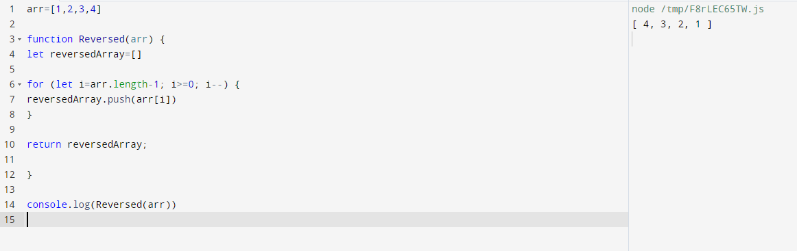

# Reverse an array.

## 1. Problem Domain
Write a function called reverseArray which takes an array as an argument. Without utilizing any of the built-in methods available to your language, return an array with elements in reversed order.<br>

Input= [2, 431, 32, 765, 102]<br>
Output= [102, 765, 32, 431, 2] <br>

## 2. Visual


## 3. Algorithm

Since we are unable to use built in methods to reverse an array, we need to find a method that will method that modify each elemnt and in this case we will use ``` For loop``` , as we know loop will go through each index in the array and using the upVote ```++``` and we need to define where the loop start and when to end so what if we started lopping through the array from the end to beggning using ```length-1``` and let's make the vot to downVote ```--``` , like this we will be able to start from the end to the start and export the last index as first index. 

## Code 

arr=[1,2,3,4]

function Reversed(arr) {
let reversedArray=[]

for (let i=arr.length-1; i>=0; i--) {
reversedArray.push(arr[i])
}

return reversedArray;

}

console.log(Reversed(arr))


### Test 

