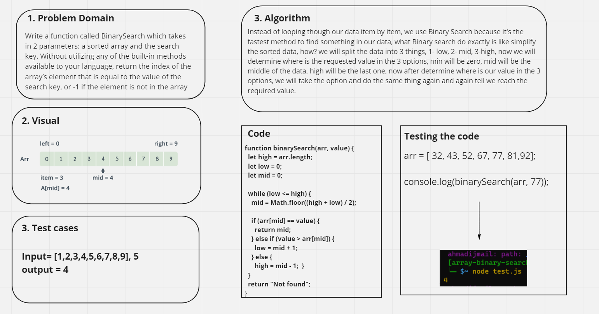

# Binary Search of Sorted Array

we need to write a function that takes 2 parametrs (sorted Array, the value we need to get the index of it), using Binary Search method and algorithm.

## Whiteboard Process

## Approach & Efficiency

So I learned what is Binary search then i applied it to this chalenge which gave me the idea of how to solve it.
## O(log N)