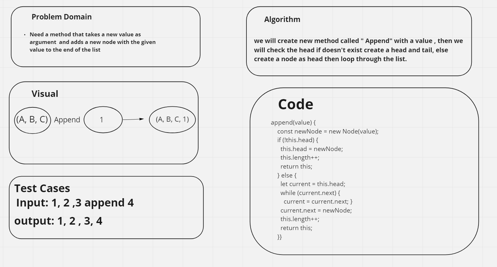
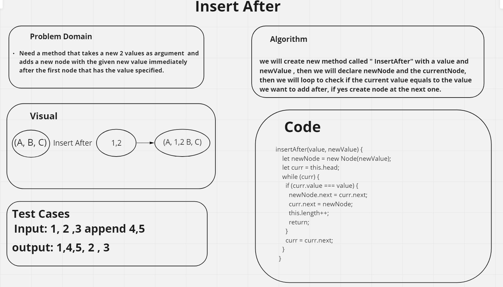
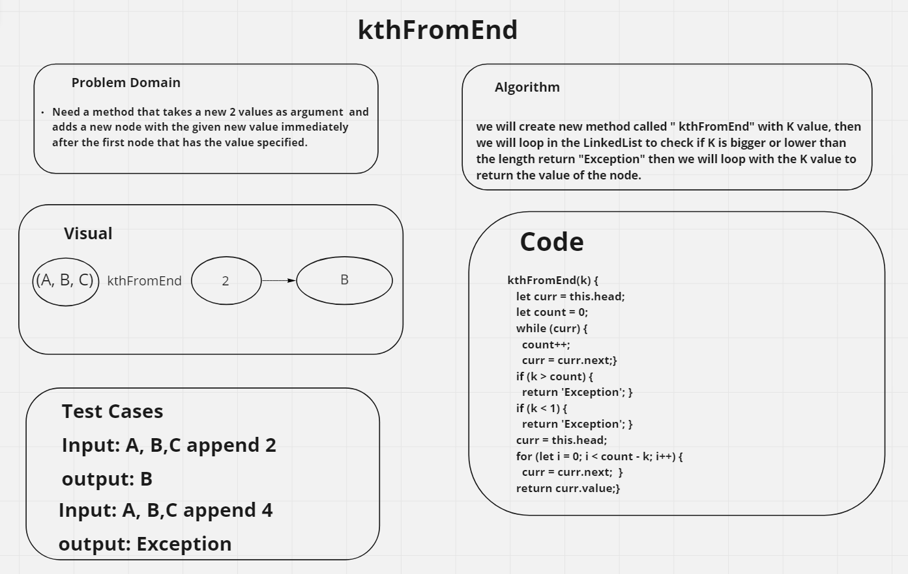

# Linked list <br>

**Defention**: a linked list is a linear collection of data elements whose order is not given by their physical placement in memory. <br>

## Challenge <br>

Create A link list that contains the following, Linked List class and the class should contain the follwing , ```insert``` with argument and returns nothing, a new node with that value to the head, ```includes``` with argument and returns Boolean,  `toString` with arguments: none and Returns: a string representing all the values in the Linked List, formatted as: "{ a } -> { b } -> { c } -> NULL". 


## WhiteBoard

1-Append 

 <br>

2- InsertAfter <br>
 <br>

3-KthFromend <br>
